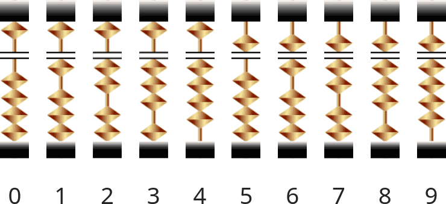

# Abacus

An abacus in Python

## Learning Objectives

After completing this project, learners will be able to:

1. Describe how an abacus is used to represent numbers, add, and subtract
2. Create simple programs in Python
3. Design and implement simple algorithms in Python

## How an abacus works

There have been many different abacus designs. The specific abacus used in this project is the Japanese [Soroban](https://en.wikipedia.org/wiki/Soroban).

The abacus is build around place values in base 10, much like the modern decimal number system. Each place value is represented by a rod. The upper portion represents either a 5 or nothing, while the lower portion adds the values 0 through for. Here is a representation of each number 0 through 9 by a configured rod:

## Task

Handout code is provided in [abacus.py](abacus.py). You task is to implement `get_rod_value`, `get_abacus_value`, `add_abacus`, and `sub_abacus` such that the provided doctests pass.

While not strictly required, it is encouraged to complete addition and subtraction directly in abacus space. Your understanding of the abacus, and this sort of computation generally, will be enhanced by moving beads around directly rather than the simpler approach of converting the entire abacus to an `int`, using the built-in `+` or `-` operator, and then creating a new abacus from the resulting `int`.

Tests can be run as `python -m doctest abacus.py`, `python abacus.py`, or `make test`, depending on your personal preference and environment.

## Resources

- [wikiHow - How an abacus works](https://www.wikihow.com/Use-an-Abacus)